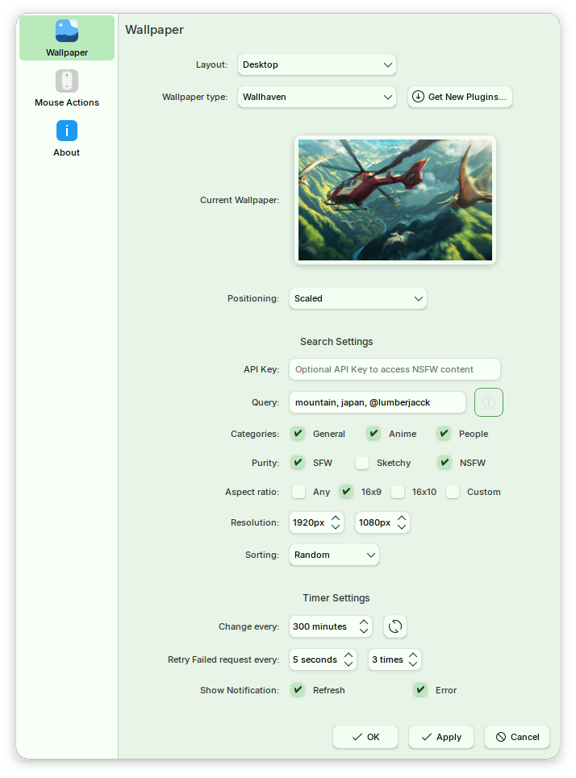

# Wallhaven Wallpaper Reborn

Port of wallhaven wallpaper plugin for plasma 5 by [subpop](https://github.com/subpop/wallhaven-wallpaper-plasma).

## Current status

Currently, the plugin is broken for the most part except:

- compile and install on plasma 6
- fetching wallpaper from wallhaven api
- set initial fetched image as wallpaper

there are some issues with config.qml not being able to access config variables in main.xml, which breaks most of the functionality, `config.qml` needs to be rewritten.

